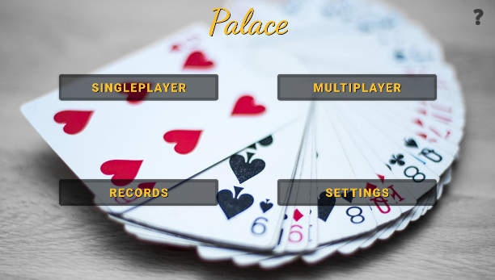

# palace-android

> Palace's Menu Screen

Palace is a card game. Well known as Shithead (mainly), Karma and Shed.

### Main goal

- Develop a card game "Palace" for Android.
- Portifolio (show project structure, data flow and use of resources that Kotlin can offer)
- Fun (I found many other card games on Play Store but none palace/shithead card game)

### Development

There were some steps (tasks) it had to consider when the game started to be implemented, as you can see below:
- [x] Core rules of the game
- [x] Regional rules of the game (variations)
- [x] Game HUD
- [x] Customization
- [x] Match records
- [x] Tutorial

Other steps in development:
- [ ] Multiplayer feature
- [ ] Credits
- [ ] Records on server

## System setup (for project)

Recommended apps & plugins:
* IntelliJ Idea Community Edition or Android Studio (latest version)
* JDK 11+
* Kotlin 1.6+

## System setup (for app)

Recommended Android Oreo (8.0) or superior.

[⬆ Back to Top](#palace-android) 